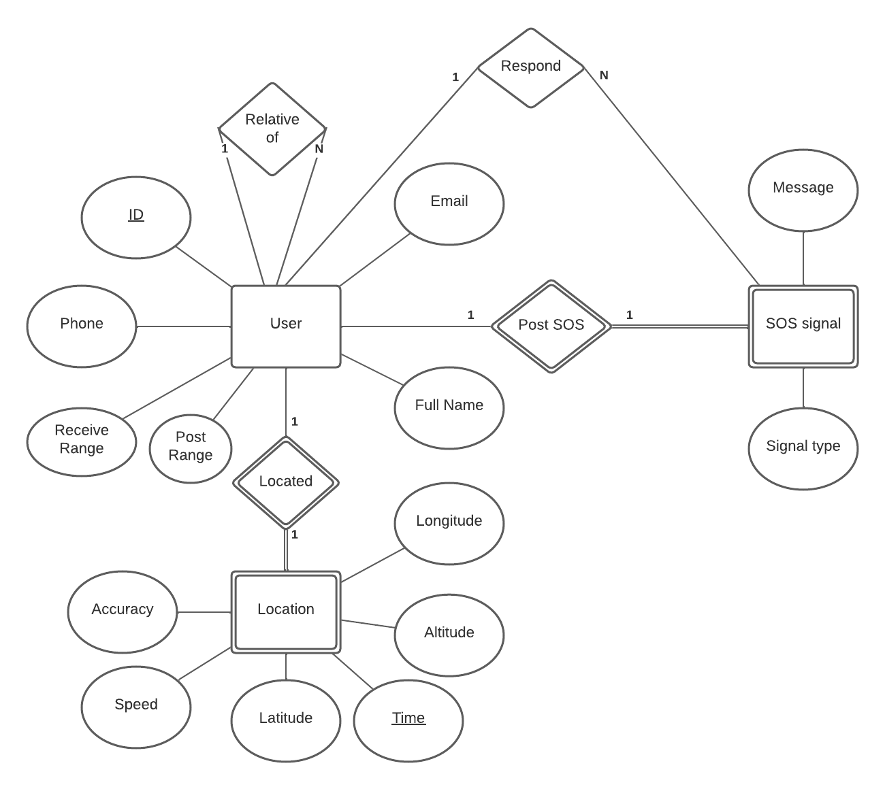

# PE2022 Team 7

## Members
+ Huỳnh Minh Triết (17447) - (Team leader) - Back end
+ Nguyen Trong Anh (15721) - UI/UX designer 
+ Nguyen Minh Tri (16164) - Front end 
+ Nguyen Vu Duy Khoi (15777) - Front end
+ Le Thanh Thong (16763) - Front end
+ Thai Hoang Tam (17387) - API specialist
+ Dinh Minh Hoang (17124) - CI/CD engineer
+ Huynh Cam Tu (16610) - Front end
+ Truong Quang Huy (18602) - DevOps 

## Project:
[Project description](Project_Proposal.pdf)

# Introduction
- Etoet is a location tracking application that allows users to make friends
with others and track their location using the "add friend" feature. 
- Users can also text and access personal information about their friends through the app, such as their email addresses and phone numbers. 
- The app also allows users to broadcast an SOS signal to others to receive 
assistance with private and public modes, giving them more options for 
getting help in an emergency.

# Motivation
In the context of the raging Covid pandemic, many people were, unfortunately, 
quarantined, leading to not being able to go out to buy essential items, Zalo 
has updated a feature to help these people call for help from the community. 
With this in mind, our team devised the idea to create Etoet by combining this 
feature with Zenly - another friend location tracking app. If there is enough 
room for development, this app could become a tool for users seeking assistance 
with health and security issues. Authorities will be able to locate the person 
in need of help more quickly and easily.

# Core features:

## [Public and Private Signal](/documentation/signal.md)

## Adding Friends and live location tracking

# Table of content 
1. [Authentication](./documentation/Authentication_architecture.md): 
2. [Database](./documentation/backend.md): Explanation on the two database and their usages.
3. [Cloud functions](./documentation/cloud_functions.md)
4. [Cloud messaging](./documentation/cloud_messaging.md) 
5. [Geohash](./documentation/geohash.md)
6. [Flutter](./documentation/Frontend/Flutter.md)
7. [CI/CD](./documentation/CICD/CICD.md)
8. [Google Map](./documentation/map/google_map.md)
9. [Friends_and_Messages](./documentation/friends_and_messages.md)
10. [Settings view](./documentation/Frontend/Settings_view.md)
